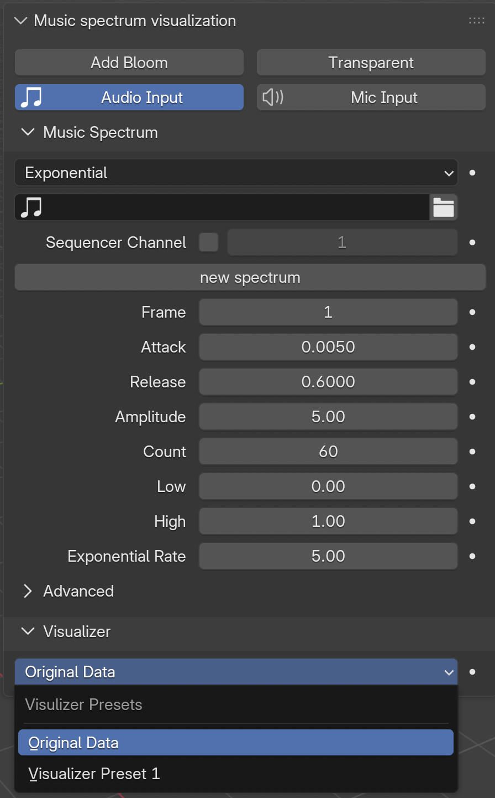
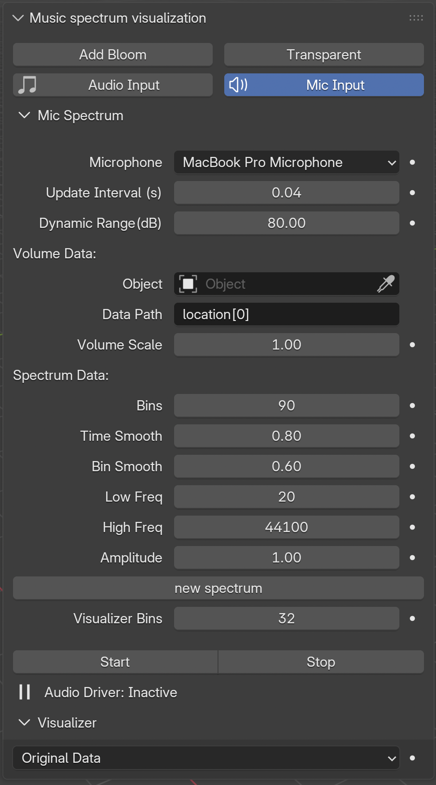

# blender_music_visualizer
audio spectrum visualization in Blender using Geometry Nodes

You can get it from my Gumroad page: [Blender Music Visualizer Addon](https://mhstar.gumroad.com/l/zfnjq)

A showcase here
<table>
<tr>
<td width="50%" align="center">

**GitHub play**  
 

</td>
<td width="50%" align="center">

**YouTube play**  
 

</td>
</tr>
</table>

# installation
> Edit -> Preference -> Addon (select on the left side bar) -> Install (on the top)
select the .zip file to install, after installation, enable it by checking the checkbox.
Go to the viewport, press `N` key to open side panel, you will find the addon at the bottom, now you can explore it to use.

~~The addon relies on the Blender shipped addon `Power Sequencer`; you also need to enable it.~~ New update for Blender 5.0 doesn't rely on it anymore.

# usage
It's pretty simple and straightforward to use.

## Audio Input

<table>
<tr>
<td>

</td>
<td>

<h3>1. Music Spectrum</h3>

It generates the audio spectrum and adjustable settings are ready to go. Just select the audio/music you would like to visualize, then press the `new spectrum` button, it is just this simple. By the way, video file is also supported, but only the audio get used.
   Once you select an audio, you will find the addon panel having an extra part called `Sequence Settings`, you can sync the timeline to the track or channel, also deleting a track from the `Video Sequence` is on power. It is so convenient that I love this function, you don't need to go to `Video Sequence` to play with the audio file, this is very useful and time saving for me.

<h3>2. Visualizer</h3>
   
You can just use the original spectrum data (the `z` location) to visualize your stuff. I also give an preset visualizer which is basic but very nice to go. I would suggest the way to go is using `Geometry Nodes`, which is easy, quick and powerful. I will post some toturials to show some examples.
</td>
</tr>
</table>

## Mic Input

<table>
<tr>
<td>

</td>
<td>

Now it's supporting live microphone to drive data. Just select an object and give the <code>Data Path</code>.

- If you don't know the <code>Data Path</code>, just right click a data and <strong>Copy Data Path</strong>.

</td>
</tr>
</table>

# Be aware

- When you change something, you may need to change frame to see the effect.  
- For the top Deco instancing part, when you choose **collection**, remember to check **Pick Instance** to separate all the objects in the collection.  
- Don't change the **mesh name** and the **modifier name**, but you can change the **object name** and the **node group name**.
  
# Tutorial
If you need more information and knowledge about my addon, you can check my tutorial on YouTube.

